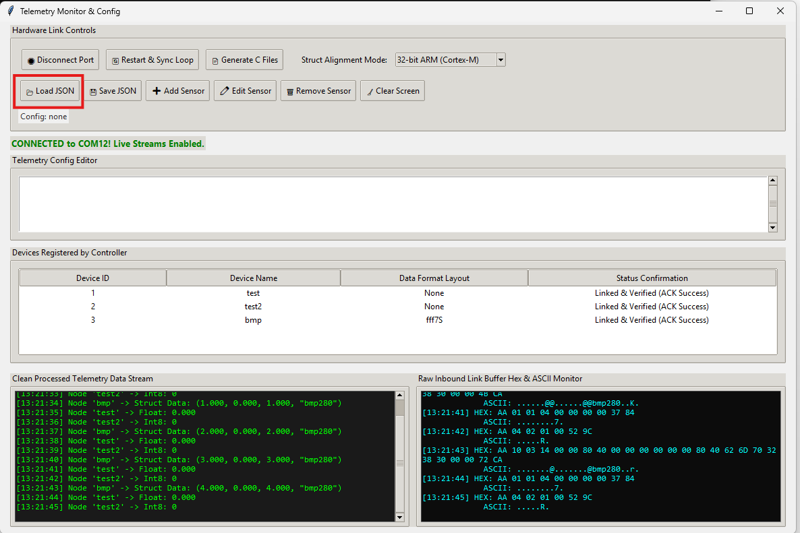
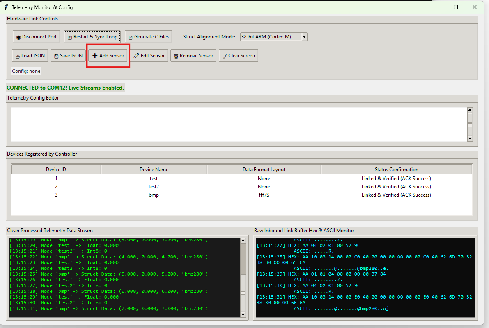
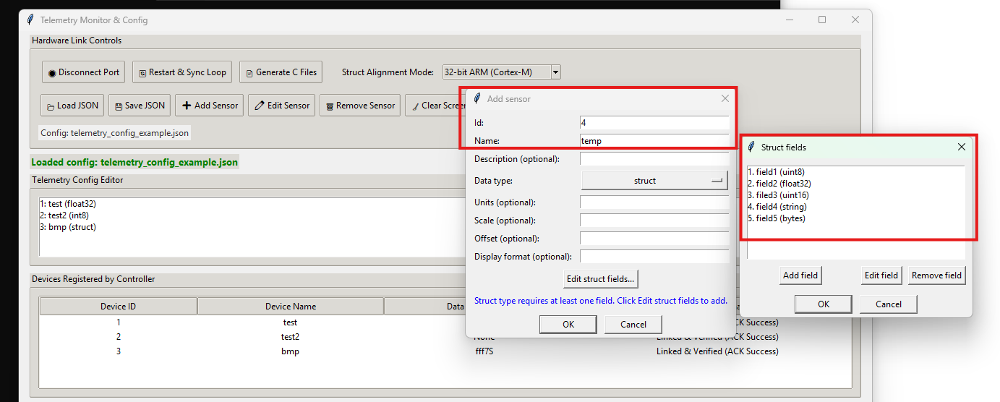
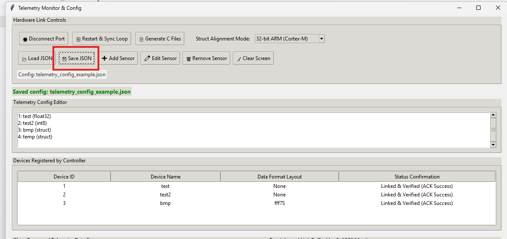
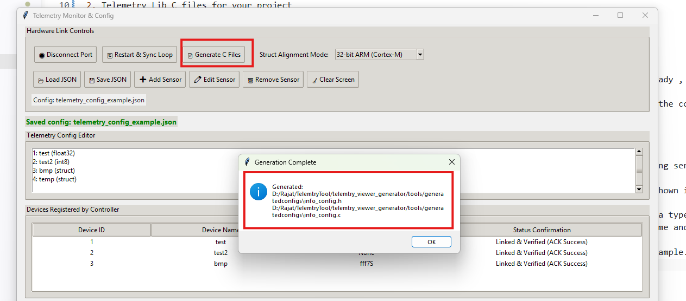

# Telemtry Viewer Tool

Tired of the constant friction between your firmware data structures and human-readable logs? Every time you add a new sensor, you shouldn't have to sacrifice precious CPU cycles converting floats, bytes, and integers into strings just for the sake of debugging.

Telemetry Viewer Tool solves this by offloading the complexity. It uses a clean, JSON-based configuration to handle data interpretation on the PC side, allowing your microcontroller to transmit raw, high-speed binary packets.

## Clone with the below two commands
1. git clone <clonelink>
2. git submodule update --init --recursive

## Why This Matters

* Zero-Overhead Debugging: Eliminate the need for sprintf, snprintf, or heavy character buffers that drain your CPU and bloat your binary size.  

* Write Once, Port Anywhere: By using a generated C configuration, your telemetry logic becomes hardware-agnostic. Define your data structure once, and it will work on an STM32, an ESP32, or any other supported platform without rewriting your communication layer.  

* High-Fidelity Data: Transmit complex structures natively—your tool parses the binary feed and presents it as readable, organized information in real-time

## The Old Way (High CPU Overhead)
```c
// Traditional approach: Manual string conversion
struct SensorData {
    float voltage;
    float current;
    uint16_t errorCode;
};

void sendTelemetryLegacy(SensorData* data) {
    char buffer[50];
    // Manually formatting the string consumes significant CPU cycles
    snprintf(buffer, sizeof(buffer), "V: %.2f, I: %.2f, Err: %u\n", 
             data->voltage, data->current, data->errorCode);
    
    // Send the converted string over UART
    HAL_UART_Transmit(&huart2, (uint8_t*)buffer, strlen(buffer), HAL_MAX_DELAY);
}
```

# The New Way (Streamlined)

If you see the above code will work very well for Stm32 based devices , but if you decide that you want the sensor to be interfaced in a different controller , you will have to do the rework again. 
Using the tool , you can have a generic config C file and other library files , in that case all you need to do is call the following functions , provided the device exist in the supported list of devices.
```c
  telemtry_init();

  telemtry_send_boot_message();
  
  telemtry_wait_for_boot_sync();
  telemtry_configure();

  for (uint8_t idx = 0; idx < (TOTAL_TELEMTRY_ID - 1); ++idx) {
      telemtry_send(buffers_array, idx);
  }
```
The above code remains same for all the supported devices.

# Requirements 
1. Working uart driver for the supported hardware
2. Telemetry Lib C files for your project

# How to use the tool
1. Click on Setup.bat file to install the needed dependencies , on success proceed to step2
2. Launch the python file from the **tools/telemtry_tool.py**
3. The UI should automatically connect to the COM port provided in the python code

# How to Add a new sensor 

1. Click on **Load json** and load the json file named `telemetry_config_example.json`.<br><br>
   <br><br>

2. Click on the **Add Sensor** button and a new pop-up window will appear.<br><br>
   <br><br>

3. Add the ID of the sensor by cross-referencing with the existing one; the ID should be equal to the last ID number shown in the json + 1.<br><br>
   <br><br>

4. Provide a name to the sensor of your choice.<br><br>
   <br><br>

5. Choose the data type; if it is a struct, you need to click on **Edit Struct fields** to add your fields and the data type of them.<br><br>
   <br><br>

6. When you are done adding, click **OK**; it should show you the added sensor in the config list listed with the name and ID you provided in the step above.<br><br>
   <br><br>

7. Click on **Save Json** and replace the already existing file with the current config; the file name is `telemetry_config_example.json`.<br><br>
   <br><br>

8. Click on **Generate C files** and select the `generateconfigs` folder as output; inside the folder, you should now see `info_config.c` and `info_config.h` files.<br><br>
   <br><br>

9. For next steps, refer to the other repo here.<br><br>
   <br><br>

# How to use the library 

 ***As a first step , the user must copy the telemtry_lib folder to the needed supported device folders , so that it can be linked and built successfully.***

1. Once the files are generated , copy the respective header and source files from the generatedconfigs folder to the telemtry_lib/Src and telemtry_lib/Inc folders
2. Add your files to Makefile or CMakelists file in order for your system to detect them.Add the below initliasing code to your main function and make the build working. 
3. Sometimes the hw files might contain other hardware than yours , you can simply remove those files or do not add them in the build process.

# Add below code lines and include headers in your main.c or app.c file and get the build working

```c
  telemtry_init();

  telemtry_send_boot_message();
  
  telemtry_wait_for_boot_sync();
  telemtry_configure();
```

# Supported Devices 
1. ESP32 DEVKIT V4
2. STM32L433 Nucleo Board

# Supported Protocols 
1. UART
### Future Roadmap & Collaboration
The UI aspect is completely AI generated , but i am looking for people who can help me make it better.